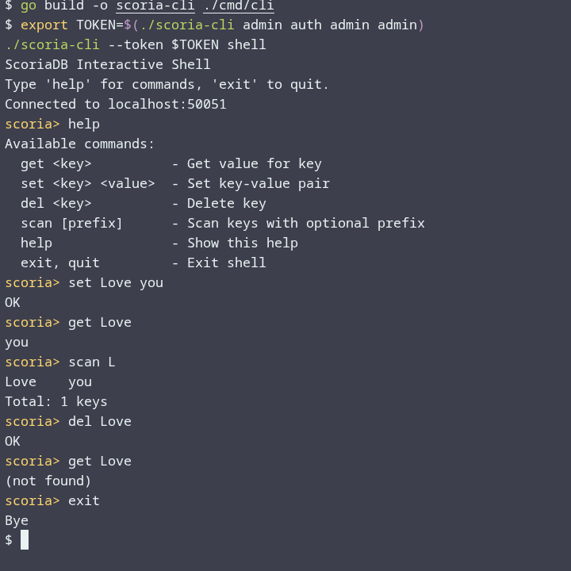

<div align="center">
  
  <br>
  
  <br><br>

  <!-- Badges -->
  <a href="https://github.com/f4ga/ScoriaDB/actions/workflows/ci.yml"></a>
  <a href="https://go.dev/"></a>
  <a href="LICENSE"></a>
  <a href="https://goreportcard.com/report/github.com/f4ga/ScoriaDB"></a>

  <!-- Language switcher (buttons) -->
  <br><br>
  <div>
    <a href="README.md"></a>
    &nbsp;&nbsp;
    <a href="README_RU.md"></a>
  </div>

  <!-- Table of contents -->
  <br>
  <table align="center" style="font-size: 1.2em; line-height: 1.8;">
    <tr>
      <td align="center">📖</td>
      <td><a href="#-what-is-scoriadb">What is ScoriaDB</a></td>
      <td align="center">👥</td>
      <td><a href="#-who-is-it-for">Who Is It For</a></td>
      <td align="center">✨</td>
      <td><a href="#-why-scoriadb">Why ScoriaDB</a></td>
    </tr>
    <tr>
      <td align="center">📊</td>
      <td><a href="#-benchmarks">Benchmarks</a></td>
      <td align="center">📊</td>
      <td><a href="#-comparison-with-redis">Comparison with Redis</a></td>
      <td align="center">🧩</td>
      <td><a href="#-features--capabilities">Features & Capabilities</a></td>
    </tr>
    <tr>
      <td align="center">🛡️</td>
      <td><a href="#-durability-and-crash-recovery">Durability & Crash Recovery</a></td>
      <td align="center">🕰️</td>
      <td><a href="#-how-mvcc-works">How MVCC Works</a></td>
      <td align="center">🚀</td>
      <td><a href="#-quick-start">Quick Start</a></td>
    </tr>
    <tr>
      <td align="center">📈</td>
      <td><a href="#-v010-release-criteria">v0.1.0 Release Criteria</a></td>
      <td align="center">📁</td>
      <td><a href="#-project-structure">Project Structure</a></td>
      <td align="center">🗺️</td>
      <td><a href="#-version-roadmap">Version Roadmap</a></td>
    </tr>
    <tr>
      <td align="center">📄</td>
      <td><a href="#-license">License</a></td>
      <td align="center">❓</td>
      <td><a href="#-faq">FAQ</a></td>
      <td align="center">🤝</td>
      <td><a href="#-support-the-project">Support the Project</a></td>
    </tr>
   </table>
</div>

<br>

## 📖 What is ScoriaDB?

**ScoriaDB** is an embeddable key‑value database written in pure Go.  
Under the hood — an LSM tree, MVCC, Column Families, WAL, and a WiscKey‑style Value Log.

- **As a library** – you write `import _ "github.com/f4ga/scoriadb/pkg/scoria"` and get an LSM engine inside your own process. No external dependencies, no cgo.
- **As a server** – run a single binary and it serves gRPC, REST, WebSocket, and CLI. A ready‑made backend for microservices in any language.

> The project is on the home stretch to **v0.1.0**. Almost everything works, tests are green.

---

## 👥 Who is it for?

| User type | Use case |
|:---|:---|
| **Go developer** | Embed a KV store into your service, CLI tool, agent, or daemon. Don’t want to spin up a separate database. |
| **IoT / Edge engineer** | A resource‑constrained device needs local storage with remote access via gRPC or REST. |
| **Microservice team** | One ScoriaDB server, clients in Python, Java, C++, Rust, Node.js, C# – via gRPC. |
| **Log analyst** | Embed a database to index and search logs (the demo tool **Scorix** already works). |
| **Student / hobbyist** | Want to understand LSM, MVCC, compaction – the source code is open and fairly readable. |

---

## ✨ Why ScoriaDB?

| Advantage | What it gives you in practice |
| :--- | :--- |
| **Embeddable** | Pure Go. No need for `apt-get install rocksdb` or worrying about cgo. |
| **Ready‑made server** | gRPC, REST, CLI, WebSocket – out of the box. No need to write HTTP wrappers, just run `scoria-server`. |
| **ACID transactions** | Snapshot Isolation, interactive transactions for complex scenarios, atomic WriteBatch for batches of operations. |
| **Column Families** | Independent LSM trees – store metadata separately from data, tune compaction per CF. |
| **MVCC** | Readers never block writers (though concurrency isn’t perfect yet). |
| **Cross‑language access** | gRPC – clients for 12+ languages. Python scripts and Java microservices can talk to the same database. |
| **Reliability** | WAL with fsync, Manifest with fsync, CRC32 on every block. After `kill -9` data is not lost. |
| **Performance** | ~150 ns reads, ~1 µs writes (small keys) |

---

## 📊 Benchmarks

*Test machine: Intel Core i3-1215U (8 threads), 16GB RAM, NVMe SSD, Go 1.23+, Linux amd64.*  
*Run with: `go test -bench=. -count=5 ./internal/engine ./pkg/scoria | benchstat`*

| Operation | Value size | Time (ns/op) | Time (ms/op) | Throughput |
|----------|----------------|---------------|---------------|------------------------|
| `engine.Put` (small) | 16 bytes | **1,070** | 0.00107 | ~935,000 ops/s |
| `engine.Put` (large) | 4 KB (goes to VLog) | **4,785** | 0.00479 | ~209,000 ops/s |
| `engine.Get` (hit) | key in MemTable | **152** | 0.00015 | ~6,580,000 ops/s |
| `engine.Get` (miss) | key does not exist | **310** | 0.00031 | ~3,225,000 ops/s |
| `ScoriaDB.Put` (public API) | 16 bytes | **1,063** | 0.00106 | ~940,000 ops/s |
| `ScoriaDB.Get` (public API) | 16 bytes | **144** | 0.00014 | ~6,940,000 ops/s |

**Notes:**
- **engine.Put** – direct engine call, no API overhead.
- **ScoriaDB.Put** – through the public `DB.Put()` interface. Overhead <1% – practically transparent.
- **Large values** (>64 bytes) go to the Value Log. Reading them includes a CRC32 check and a copy from mmap (not zero‑copy yet, honestly).
- **Miss** is faster than hit because there is no value to decode.

**What these numbers mean in reality:**
- If you write in batches via WriteBatch (say 100 operations), fsync overhead is amortised and you become disk‑bound. On NVMe – tens of microseconds per write.
- Reads almost never stall, even under heavy writes – MVCC rules.

---

## 📊 Comparison with Redis

**Important caveat:** ScoriaDB is **not** a replacement for Redis. They solve different problems. Redis is a super‑fast in‑memory cache with network access. ScoriaDB is a disk‑based, embeddable store with transactions. The comparison below is purely for understanding numbers.

| Feature | ScoriaDB (embedded) | Redis CE (network) |
| :--- | :--- | :--- |
| **Deployment** | Library or server | Only server |
| **Network overhead** | None (when embedded) | TCP (typically 0.1–0.2 ms) |
| **Read latency (Get)** | ~150 ns | ~0.24–0.31 ms |
| **Write latency (Set)** | ~1,070 ns | ~0.45 ms |
| **Persistence** | Full, with fsync | Optional (RDB/AOF) |
| **Transactions** | ACID, Snapshot Isolation, optimistic locking | None (only pipelining) |
| **MVCC** | Yes, readers don't block writers | No |
| **Column Families** | Yes | No |
| **Embeddable** | Yes, `import` | No, separate process |
| **Languages** | gRPC (12+), plus direct Go API | Native clients per language |

**Bottom line:** if you need a blazing fast cache with lots of data structures – pick Redis. If you need a reliable, embeddable database with transactions and remote access – give ScoriaDB a try.

---

## 🧩 Features & Capabilities

### 1. LSM Engine

| Component | Status | Notes |
| :--- | :---: | :--- |
| **MemTable** | ✅ | B‑tree from `google/btree` with a global mutex (yes, it's a bottleneck, but it works). |
| **SSTable** | ✅ | Block index, key prefix compression, Bloom filter, range filter (min/max key). |
| **Leveled Compaction** | ✅ | Classic LevelDB algorithm: L0 → L1 → L2 → L3. L0 may overlap, L1+ do not. |
| **Block Compression** | ✅ | Snappy and Zstd at the SSTable block level. |
| **Bloom filter** | ✅ | Probabilistic structure to avoid reading SSTable when a key is certainly missing. |
| **Value Log (WiscKey)** | ✅ | Values >64 bytes go to a separate append‑only `.vlog` file. Reads via mmap (with copying for now). |

### 2. Durability and Journals

| Component | Status | Notes |
| :--- | :---: | :--- |
| **WAL** | ✅ | Every operation is written to the WAL with a CRC32 before entering the MemTable. Recovery after crash. |
| **Manifest** | ✅ | JSON journal of SSTable set changes. Each entry is fsync’ed. |
| **fsync per batch** | ✅ | Yes, it's expensive, but data is not lost. |
| **Block CRC32** | ✅ | Every SSTable block and Value Log entry has a checksum. |
| **Fail‑safe VLog** | ✅ | On magic mismatch, the file is renamed to `.corrupt`, a new one is created, and data is recovered from WAL. |

### 3. Transactions and MVCC

| Feature | Status | Notes |
| :--- | :---: | :--- |
| **MVCC** | ✅ | Each write gets a `commitTS`. Deletion is a tombstone. |
| **Snapshot Isolation** | ✅ | A transaction sees a consistent snapshot at its `startTS`. |
| **Interactive transactions** | ✅ | `Begin()` → `Get`/`Put`/`Delete` → `Commit()`/`Rollback()`. Retry on conflict. |
| **WriteBatch** | ✅ | Atomic group of operations – all or nothing. |
| **Conflict detection** | ✅ | At commit time, checks if any key was modified after `startTS`. |
| **Timestamp generator** | ✅ | Atomic `atomic.AddUint64`, persistent (saved in Manifest). |

### 4. Column Families

| Feature | Status | Notes |
| :--- | :---: | :--- |
| **Independent LSM** | ✅ | Each CF has its own file set, MemTable, compaction. |
| **Shared WAL** | ✅ | Atomic WriteBatch across CF – a single WAL entry. |
| **Per‑CF settings** | 🛠️ | Currently just MemTable size (plans: separate compaction tuning, TTL). |

### 5. APIs and Interfaces

| Interface | Status | Notes |
| :--- | :---: | :--- |
| **Embedded Go API** | ✅ | `type DB interface { Get, Put, Delete, Scan, Begin, ... }`. |
| **gRPC API** | ✅ | Proto file in `proto/`, generated code in `scoriadb/`. Supports Scan streaming. |
| **REST API** | ✅ | Gin server: `GET /api/v1/kv/{key}`, `POST /api/v1/kv`, `DELETE /...`. Swagger coming later. |
| **WebSocket** | ✅ | Subscribe to key changes: client gets a notification on `Put`/`Delete`. |
| **CLI (`scoria`)** | ✅ | Cobra: `set`, `get`, `del`, `scan`, `txn begin/commit`, `admin auth`, `admin user create`. Interactive mode. |

### 6. Security and Monitoring

| Feature | Status | Notes |
| :--- | :---: | :--- |
| **JWT Authentication** | ✅ | Tokens with roles, HMAC or RSA signature. |
| **Roles** | ✅ | `admin` (everything), `readwrite` (CRUD), `readonly` (read only). |
| **Seed user** | ✅ | On first start, `admin/admin` is created – change the password! |
| **Prometheus metrics** | ✅ | `/metrics` endpoint: operation counters, latency histograms, MemTable size, file counts per level. |
| **Health / ready** | ✅ | `/health` – always 200, `/ready` – checks if reads are possible. |

---

## 🛡️ Durability and Crash Recovery

ScoriaDB is designed to **not lose data** even after a sudden power loss.

### How it works:

1. **WAL (Write‑Ahead Log).**  
   Before placing an operation into the MemTable, I write it to the WAL together with a CRC32. Then I call `fsync`. If the server crashes at that moment, the operation is either entirely in the WAL or not. On startup, I replay the WAL and recover everything that didn't make it to an SSTable.

2. **Manifest (metadata journal).**  
   During compaction, I delete old SSTables and add new ones. Instead of scanning the directory (unreliable), I write every change to the Manifest and also `fsync`. On startup, I read the Manifest – and know exactly which files are active.

3. **Value Log.**  
   Each `.vlog` file has a header with a magic number. On opening, I check it. If it doesn't match, the file is considered corrupted. I rename it to `.corrupt`, create a new one, and recover data from the WAL. Entries pointing to the old file are skipped (they are lost), but the database remains consistent.

### What this gives:

- **Write durability** – once `Put` returns success, the write won't disappear even after `kill -9`.
- **Metadata consistency** – never out of sync with actual files.
- **No manual repair** – the database recovers itself after a crash.

### The price:

- `fsync` on every WriteBatch is expensive. Roughly **5 times slower** than buffered writes. In v0.2.0, Group Commit will amortise the overhead.

---

## 🕰️ How MVCC Works

MVCC (Multi‑Version Concurrency Control) is a way to read and write concurrently without locks.

### Core idea:

- Every `Put` creates a **new version** of the key instead of overwriting the old one.
- Each version has a timestamp `commitTS` (uint64).
- A transaction gets a `startTS` when it begins – a snapshot of the current moment.
- Inside the transaction, all reads see versions with `commitTS ≤ startTS`.
- On commit, a new `commitTS` is generated (greater than any previous). If any key that the transaction modified already has a version with `commitTS > startTS` – someone else wrote it after the transaction started. Conflict! The transaction rolls back and you must retry it.

### Inverted timestamp – why fresh records appear first?

I store keys in the LSM in the format: `[user_key][^commitTS]`.  
`^commitTS` is the bitwise NOT of the timestamp. Since `commitTS` grows, `^commitTS` decreases. Therefore fresh records appear **earlier** in lexicographic order. An iterator runs from newest to oldest by default – very convenient for scenarios where you need the latest version.

### Example:

```go
db.Put("user:1", "alice")   // commitTS = 100
db.Put("user:1", "bob")     // commitTS = 101

// Iterating over "user:1" will show bob (commitTS 101) first, then alice (100).
```

### Readers don't block writers – how?

- Writers add new versions without touching old ones.
- Readers work with a snapshot (`startTS`) frozen at the beginning.
- No read locks at all.

The cost: old versions accumulate. Compaction removes them, but it never touches versions still needed by active transactions.

---

## 🚀 Quick Start

### 1. Using Docker (recommended)

```bash
git clone https://github.com/f4ga/ScoriaDB.git
cd ScoriaDB
docker compose -f deployments/docker-compose.yml up --build
```

The server will be listening on:
- `:50051` – gRPC
- `:8080` – REST and WebSocket (Web UI not yet, only API)

Check it:

```bash
# In another terminal
docker exec -it scoria-server ./scoria-cli admin auth admin admin
# Get the token, then:
docker exec -it scoria-server ./scoria-cli --token <token> set hello world
docker exec -it scoria-server ./scoria-cli --token <token> get hello
```

### 2. Local build

```bash
go build -o scoria-server ./cmd/server
go build -o scoria-cli ./cmd/cli

./scoria-server &
# Server listens on :50051 and :8080

# Get a token (admin/admin is created on first run)
TOKEN=$(./scoria-cli admin auth admin admin)

# CRUD
./scoria-cli --token "$TOKEN" set hello world
./scoria-cli --token "$TOKEN" get hello

# Interactive transaction
./scoria-cli --token "$TOKEN" txn begin
./scoria-cli --token "$TOKEN" txn set a 1
./scoria-cli --token "$TOKEN" txn set b 2
./scoria-cli --token "$TOKEN" txn commit

# Scan
./scoria-cli --token "$TOKEN" scan -p "a" -l 10

# Interactive CLI shell
./scoria-cli --token "$TOKEN" shell
```
## 💻 CLI Demo



### 3. From Go code (embedded mode)

```go
package main

import (
    "log"
    "github.com/f4ga/scoriadb/pkg/scoria"
)

func main() {
    db, err := scoria.Open("/path/to/data", nil)
    if err != nil {
        log.Fatal(err)
    }
    defer db.Close()

    // Simple write
    db.Put([]byte("hello"), []byte("world"))

    // Transaction
    txn := db.Begin()
    val, _ := txn.Get([]byte("hello"))
    txn.Put([]byte("foo"), []byte("bar"))
    if err := txn.Commit(); err != nil {
        log.Fatal(err)
    }
}
```

### 4. Run tests

```bash
go test -race ./...
go test -bench=. ./internal/engine ./pkg/scoria
```

---

## 📈 v0.1.0 Release Criteria

The following items are **already done** ✅ :

| Category | Component | Status |
| :--- | :--- | :---: |
| **Core** | LSM tree, Value Log, WAL, Manifest | ✅ |
| **SSTable** | Block index, prefix compression, Bloom filter, CRC | ✅ |
| **Compaction** | Leveled, multi‑way merge, snapshot‑safe | ✅ |
| **MVCC** | Snapshot Isolation, inverted timestamps | ✅ |
| **Transactions** | WriteBatch, interactive, conflict detection | ✅ |
| **Column Families** | Registry, independent LSM, shared WAL | ✅ |
| **API** | Embedded, gRPC, REST, WebSocket | ✅ |
| **CLI** | All major commands, interactive mode | ✅ |
| **Authentication** | JWT, roles, seed user | ✅ |
| **Docker / CI** | Images, GitHub Actions | ✅ |
| **Metrics** | Prometheus, health, ready | ✅ |
| **Tests** | Unit, integration, race detector | ✅ |
| **Stress tests** | Concurrency, crash recovery, long‑running | ✅ |

---

## 📁 Project Structure

```
scoriadb/
├── cmd/                         # Entry points
│   ├── server/                  # Server (gRPC, REST, WebSocket)
│   │   └── main.go
│   └── cli/                     # CLI client (Cobra)
│       └── main.go
├── internal/                    # Internal core (not for external import)
│   ├── engine/                  # LSM engine
│   │   ├── engine.go            # Main DB object
│   │   ├── memtable.go          # MemTable (B‑tree)
│   │   ├── sstable/             # SSTable I/O
│   │   │   ├── reader.go
│   │   │   ├── writer.go
│   │   │   ├── bloom.go
│   │   │   └── block.go
│   │   ├── vlog.go              # Value Log (mmap + copy)
│   │   ├── wal.go               # Write‑Ahead Log
│   │   ├── manifest.go          # JSON metadata journal
│   │   ├── compaction.go        # Leveled compaction
│   │   ├── vfs/                 # Filesystem abstraction (for tests)
│   │   └── tests/               # Engine integration tests
│   ├── mvcc/                    # MVCC: key encoding with timestamps
│   │   └── timestamp.go
│   ├── txn/                     # Transactions
│   │   ├── transaction.go       # Interactive transactions
│   │   └── writebatch.go
│   ├── cf/                      # Column Families
│   │   ├── registry.go
│   │   └── batch.go
│   └── api/                     # Network interfaces
│       ├── grpc/                # gRPC server
│       ├── rest/                # Gin server
│       └── ws/                  # WebSocket hub
├── pkg/scoria/                  # Public API (for embedding)
│   ├── db.go                    # DB and CFDB interfaces
│   ├── options.go
│   └── tests/                   # API tests
├── proto/                       # Protobuf specs
│   └── scoria.proto
├── scoriadb/                    # Generated pb.go
├── tests/                       # End‑to‑end tests
├── deployments/                 # Docker and docker‑compose
│   ├── Dockerfile.server
│   ├── Dockerfile.cli
│   └── docker-compose.yml
└── docs/                        # Documentation (coming soon)
```

---

## 🗺️ Version Roadmap

> **Plans may change, arrive earlier or later. I can only promise that everything listed will eventually be there.**

| Version | What will be included | Estimated release |
| :--- | :--- | :--- |
| **v0.1.0** | **What already exists.** All components listed above. Limitations: B‑tree with mutex, JSON Manifest, fsync per batch, manual GC, no zero‑copy, no Web UI, no TTL. | April 2026 |
| **v0.2.0** | Web UI (React: key table, charts, user management), TUI (terminal interface with bubbletea), Group Commit (one fsync per batch group), Fixing VFS, TTL (automatic expiry of old keys) | May 2026 |
| **v0.3.0** | Lock‑free skip list (instead of B‑tree with mutex), true zero‑copy Value Log (with reference counting), automatic incremental GC for Value Log, binary Manifest (instead of JSON). | May–June 2026 |
| **v0.4.0+** | Raft replication, sharding, distributed ACID transactions, native data structures (Sorted Sets, queues, JSON, secondary indexes), mTLS, Row‑Level Security, audit, Time Travel Queries. | Autumn 2026 |
| **v1.0.0** | – | Q1 2027 |

---

## 📄 License

ScoriaDB is distributed under the **Apache License 2.0**.  
The full license text is in the [LICENSE](LICENSE) file.

**Obligations:** you must retain the copyright notice and the list of dependencies (see [NOTICE](NOTICE)).

**Permitted:** use, modify, distribute, sublicense, use in commercial projects.

**Not permitted:** use the name ScoriaDB.

---

## ❓ FAQ

### 1. Is ScoriaDB production‑ready?
**v0.1.0 – yes, for moderate workloads and embedded scenarios.** If you have 10–20 concurrent writes and a few readers, it will work fine. If you plan 1000+ goroutines constantly writing, better wait for v0.3.0 where lock‑free skip list and automatic GC will arrive.

### 2. Does zero‑copy actually work?
**No. Not yet.** The current implementation copies data from the mmap region into new memory. This is done to avoid SIGSEGV when the database is closed. True zero‑copy will come in v0.3.0.

### 3. Why are writes slow?
Because of `fsync` after every batch. This guarantees that data is not lost. In v0.2.0, Group Commit will land – then latencies will drop 3–5 times, roughly to the level of buffered writes, while retaining durability.

### 4. How is it different from BadgerDB?
BadgerDB is a great library, but it lacks:
- a built‑in server (gRPC/REST/CLI);
- interactive transactions (`Begin/Commit`);
- Column Families.
ScoriaDB offers all that plus pure Go without cgo.

### 5. And from BoltDB?
BoltDB is a B+‑tree with a single writer and no network. ScoriaDB is LSM, concurrent writes, MVCC, and has a server.

### 6. Can I use it from Python?
Yes, via gRPC.

### 7. How do I run the Web UI?
Not yet – it's under development for v0.2.0. Stay tuned.

### 8. Does it support distributed mode?
No, that's a goal for v0.5.0. Currently only local mode.

### 9. Can I contribute?
Yes! Pull requests are welcome. Read [CONTRIBUTING.md](CONTRIBUTING.md). Help is especially needed with automatic GC and lock‑free structures.

---

## 🤝 Support the Project

If ScoriaDB is useful to you, or even just interesting, you can help in several ways:

- ⭐ **Star** the repository on GitHub
- 🐛 **Report bugs** – every bottleneck found makes the database better.
- 💻 **Submit a PR** – even a single fixed typo in the documentation is already help.
- 📣 **Share the project** on social media, with friends, or colleagues.

---

<div align="center">
  <i>Solid as stone. Light as ash.</i>
  <br><br>
  <a href="https://github.com/f4ga/ScoriaDB">github.com/f4ga/ScoriaDB</a>
  <br><br>
  
</div>