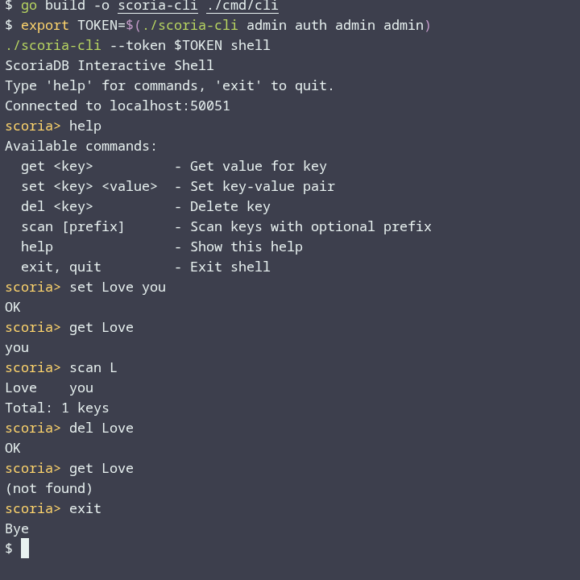

# ScoriaDB Documentation (v0.2.0)

**Quick links:** [GitHub](https://github.com/f4ga/ScoriaDB) | [Full README](../README.md)

---

## Table of Contents

### Core Documentation
1. [What is ScoriaDB?](#1-what-is-scoriadb)
2. [Benchmarks](#2-benchmarks)
3. [Group Commit](#3-group-commit)
4. [Comparison with Redis](#4-comparison-with-redis)
5. [Release Status](#5-release-status)
6. [Version Roadmap](#6-version-roadmap)
7. [When to Use ScoriaDB](#7-when-to-use-scoriadb)
8. [Installation](#8-installation)
9. [Server Mode: gRPC, REST, CLI](#9-server-mode-grpc-rest-cli)
   - [Interactive Shell Commands](#interactive-shell-commands)
   - [REST API](#rest-api)
   - [gRPC API](#grpc-api)
10. [Authentication and Authorization](#10-authentication-and-authorization)
11. [Garbage Collection (Value Log)](#11-garbage-collection-value-log)
12. [Monitoring (Prometheus)](#12-monitoring-prometheus)
13. [Known Limitations (v0.2.0)](#13-known-limitations-v020)
14. [Stress Testing](#14-stress-testing)
15. [Contributing](#15-contributing)

### Go (Embedded API)
16. [Quick Start (Go)](#16-quick-start-go)
17. [Core Operations in Go](#17-core-operations-in-go)
18. [Column Families in Go](#18-column-families-in-go)
19. [Atomic WriteBatch in Go](#19-atomic-writebatch-in-go)
20. [Transactions in Go](#20-transactions-in-go)

### Other Languages (gRPC Clients)
21. [Multi‑Language Clients](#21-multi-language-clients)

---

## 1. What is ScoriaDB?

ScoriaDB is an **embeddable key‑value database** written in pure Go.

It combines:

- LSM‑tree engine (MemTable, SSTable, Leveled Compaction)
- MVCC with Snapshot Isolation
- Interactive transactions and atomic WriteBatch
- Column Families (independent LSM trees inside a single database)
- WiscKey‑style Value Log for large values (>64 bytes)
- WAL + Manifest with `fsync` for crash durability
- **Group Commit** – buffered writes with periodic fsync (4–5× faster durable writes)
- Built‑in gRPC, REST, WebSocket, and CLI
- JWT authentication with roles (`admin`, `readwrite`, `readonly`)

**License:** Apache 2.0

---

## 2. Benchmarks

**Test environment:** Intel Core i3-1215U (8 threads), NVMe SSD, Go 1.23+, Linux amd64.  
**Command:** `go test -bench=. -count=5 ./internal/engine ./pkg/scoria | benchstat`

| Operation | Value size | Time (ns/op) | Throughput (ops/s) |
|-----------|------------|--------------|--------------------|
| `engine.Put` (small) | 16 B | **1 070** | ~935 000 |
| `engine.Put` (large, VLog) | 4 KB | **4 785** | ~209 000 |
| `engine.Get` (hit, MemTable) | – | **152** | ~6 580 000 |
| `engine.Get` (miss) | – | **310** | ~3 225 000 |
| **Group Commit WAL (sequential)** | ~50 B | **94.9 ns** | ~10 540 000 |

> **Batch writes** (WriteBatch of 100 items) give **~970 000 ops/s** with full durability – fsync amortised.  
> **Reads never stall** – even under heavy concurrent writes (MVCC).

For more detailed benchmarks, see the [full README](../README.md#-benchmarks).

---

## 3. Group Commit

Group Commit is a WAL optimization that batches multiple write operations and calls `fsync` periodically (default every 10 ms). This reduces the number of expensive disk syncs while preserving durability.

| Mode | Latency (ns/op) | Throughput (ops/s) |
|:---|:---:|:---:|
| Sync (fsync each op) | 454 | 2 200 000 |
| **Group Commit (10ms)** | **94.9** | **10 500 000** |

*Group Commit is already released and enabled by default in the server mode.* It improves write throughput by **4–5×** without sacrificing safety.

For technical details, see the [Group Commit design document](../group_commit.md).

---

## 4. Comparison with Redis

ScoriaDB is **not** a Redis replacement – different niches. Redis: in‑memory cache. ScoriaDB: disk‑based, durable, embeddable KV.

| Feature | ScoriaDB (embedded) | Redis CE (networked) |
|:---|:---|:---|
| Deployment | Library or server | Separate server |
| Network overhead | none | ~0.1–0.2 ms TCP |
| Read latency | **~150 ns** | ~0.24–0.31 ms |
| Write latency (sync) | **~1 070 ns** | ~0.45 ms (AOF everysec) |
| Persistence | **full fsync** | optional (RDB/AOF) |
| Transactions | **ACID + Snapshot Isolation** | none (pipelining) |
| MVCC | **yes** | no |
| Column Families | **yes** | no |

---

## 5. Release Status

### v0.2.0 – current stable (May 2026)

This release focuses on **write performance, durability control, and documentation**.

| Feature / Improvement | Description |
|:---|:---|
| **Group Commit in WAL** | Buffered writes with periodic fsync (10 ms interval). Improves write throughput by 4–5× without sacrificing durability. |
| **WAL group commit writer** | Asynchronous flush loop + ticker, configurable interval. |
| **Public API for WAL options** | `OpenWALWithOptions` and `EngineOptions` allow enabling Group Commit. |
| **Multi‑language documentation** | Full gRPC examples and guides for **Python, Java, C++** (see `docs/`). |
| **Benchmark suite** | Extended benchmarks for sync vs group commit, different value sizes. |
| **Crash recovery tests** | Validated durability with Group Commit enabled. |

> All core features from v0.1.0 remain (LSM, MVCC, transactions, Column Families, gRPC/REST/CLI, etc.). v0.2.0 is backward‑compatible.

---

## 6. Version Roadmap

| Version | Focus | Key features | Planned release |
|:---|:---|:---|:---|
| **v0.1.0** | Initial stable | LSM, MVCC, ACID, Column Families, gRPC, CLI, basic GC | April 2026 ✅ |
| **v0.1.1** | CLI & docs | Interactive shell commands (`create-cf`, `list-cf`, `whoami`, `stats`, history, export), Python/Java/C++ docs | May 2026 ✅ |
| **v0.2.0** | Write performance | **Group Commit** (WAL), WAL options, crash recovery tests | May 2026 ✅ |
| **v0.2.1** | Minor fixes & QoL | Windows/macOS CI, `admin delete-user`, `admin get-user` | June 2026 |
| **v0.3.0** | Web UI & TTL | React dashboard, TTL (time‑to‑live) for records, Group Commit by default | Q3 2026 |
| **v0.4.0** | Core rewrite | Lock‑free skip list (instead of B‑tree), true zero‑copy Value Log, automatic incremental GC | Q4 2026 |
| **v1.0.0** | Distributed mode | Raft replication, range sharding, distributed ACID transactions (2PC), native data structures (Sorted Sets, Lists, JSON indexes) | 2027 |

> **Note:** Versions with a ✅ are already released. The roadmap is subject to change based on feedback and contributor availability.

---

## 7. When to Use ScoriaDB

| Use case | Why ScoriaDB |
|----------|---------------|
| **Embedded storage in Go services** | Zero external dependencies, pure Go, easy `import`. |
| **Edge / IoT devices** | Lightweight, local storage + remote access via gRPC. |
| **Microservices** | One server – clients in any language (gRPC). |
| **Log analysis (demo: Scorix)** | Efficient prefix scans and aggregations. |
| **Learning LSM / MVCC internals** | Clean, readable source code. |

> **Not recommended for:**  
> Large‑scale distributed systems (no replication yet), extremely write‑heavy workloads (lock‑free MemTable planned for v0.3.0), full SQL queries.

---

## 8. Installation

### As a Go library

```bash
go get github.com/f4ga/ScoriaDB@v0.2.0
```

### As a standalone server

```bash
git clone https://github.com/f4ga/ScoriaDB.git
cd ScoriaDB
go build -o scoria-server ./cmd/server
go build -o scoria-cli ./cmd/cli
```

### Using Docker

```bash
docker compose -f deployments/docker-compose.yml up --build
```

---

## 9. Server Mode: gRPC, REST, CLI

Run the server:

```bash
./scoria-server --db-path ./data --grpc-port 50051 --http-port 8080
```

### Interactive Shell

Start the interactive shell:

```bash
./scoria-cli --token $TOKEN shell
```

#### Basic Commands

| Command | Description | Example |
|---------|-------------|---------|
| `get <key>` | Get value | `get user:1` |
| `set <key> <value>` | Set value | `set user:1 Alice` |
| `del <key>` | Delete key | `del user:1` |
| `scan [prefix]` | Scan keys by prefix | `scan user:` |
| `export <prefix> <file>` | Export scan results to file | `export user: ./users.txt` |

#### Column Family Management

| Command | Description | Example |
|---------|-------------|---------|
| `use <cf>` | Switch current Column Family | `use logs` |
| `cf` | Show current Column Family | `cf` |
| `list-cf` | List all Column Families | `list-cf` |
| `create-cf <name>` | Create a new Column Family | `create-cf logs` |
| `delete-cf <name>` | Delete a Column Family | `delete-cf logs` |

#### Informational Commands

| Command | Description | Example |
|---------|-------------|---------|
| `whoami` | Show current user and roles | `whoami` |
| `stats` | Show key statistics for current CF | `stats` |
| `history` | Show command history | `history` |
| `last-error` | Show last error | `last-error` |
| `clear` | Clear screen | `clear` |

#### Admin Commands

| Command | Description | Example |
|---------|-------------|---------|
| `admin change-password <user> <pass>` | Change user password | `admin change-password admin newpass` |
| `admin user-add <user> <pass> [--roles=...]` | Create new user | `admin user-add john 123 --roles=readwrite` |
| `admin list-users` | List all users | `admin list-users` |

#### Demo: CLI



#### Example Session

```bash
scoria> whoami
Username: admin
Roles: admin

scoria> create-cf logs
Column family 'logs' created

scoria> use logs
Switched to column family: logs

scoria> set hello world
OK

scoria> get hello
world

scoria> use default
Switched to column family: default

scoria> scan
Total: 2 keys
  hello → world
  user:1 → Alice

scoria> exit
Goodbye!
```

### REST API

| Method | Endpoint | Description |
|--------|----------|-------------|
| GET | `/api/v1/kv/{key}` | Get value |
| PUT | `/api/v1/kv/{key}` | Set value (JSON: `{"value":"..."}`) |
| DELETE | `/api/v1/kv/{key}` | Delete key |
| POST | `/api/v1/kv/scan` | Scan (JSON: `{"prefix":"..."}`) |
| POST | `/api/v1/auth/login` | Login (JSON: `{"username":"...","password":"..."}`) |

**Examples:**

```bash
# Read
curl http://localhost:8080/api/v1/kv/hello

# Write
curl -X PUT http://localhost:8080/api/v1/kv/hello -d '{"value":"world"}'

# Scan
curl -X POST http://localhost:8080/api/v1/kv/scan -d '{"prefix":"user"}'

# Login
curl -X POST http://localhost:8080/api/v1/auth/login -d '{"username":"admin","password":"admin"}'
```

### gRPC API

Proto file: [`proto/scoriadb.proto`](https://github.com/f4ga/ScoriaDB/blob/main/proto/scoriadb.proto)

Go client example:

```go
conn, _ := grpc.NewClient("localhost:50051", grpc.WithTransportCredentials(insecure.NewCredentials()))
client := proto.NewScoriaDBClient(conn)
resp, _ := client.Get(ctx, &proto.GetRequest{Key: []byte("hello")})
```

**When to use server mode:**  
You need remote access from multiple clients, different programming languages, or a standalone database process.

---

## 10. Authentication and Authorization

ScoriaDB uses **JWT tokens** with roles:

| Role | Permissions |
|------|-------------|
| `admin` | All operations (including user management) |
| `readwrite` | Put, Delete, Scan (no user management) |
| `readonly` | Get, Scan only |

**Commands:**

```bash
# Get token (admin/admin on first start)
TOKEN=$(./scoria-cli admin auth admin admin)

# Create a user (admin only)
./scoria-cli admin user-add john mypass --roles readwrite

# Use token
./scoria-cli --token $TOKEN set hello world
```

**When to use authentication:**  
When the server is exposed over a network and you need access control.

> ⚠️ **Important:** On first start, the database creates an `admin/admin` user. **Change the password immediately in production.**

---

## 11. Garbage Collection (Value Log)

The Value Log (`.vlog` file) grows over time even after keys are deleted. Run manual GC to reclaim disk space:

```bash
./scoria-cli admin gc
```

**When to run GC:**  
When disk usage is high and you can tolerate a short write pause (GC stops writes during execution).

> **Note:** Automatic incremental GC is planned for v0.3.0.

---

## 12. Monitoring (Prometheus)

The HTTP server exposes a `/metrics` endpoint on port 8080.

| Metric | Type | Description |
|--------|------|-------------|
| `scoria_writes_total` | Counter | Total writes per CF |
| `scoria_reads_total` | Counter | Total reads per CF |
| `scoria_memtable_size_bytes` | Gauge | Current MemTable size |
| `scoria_level_files` | Gauge | SSTable files per level |
| `scoria_compaction_duration_seconds` | Histogram | Compaction duration |
| `scoria_stall_count` | Counter | Write stalls due to L0 overflow |

```bash
curl http://localhost:8080/metrics
```

**When to use:** Production monitoring with Prometheus + Grafana.

---

## 13. Known Limitations (v0.2.0)

| Limitation | Planned fix |
|------------|--------------|
| MemTable uses B‑tree with global mutex | lock‑free skip list – v0.3.0 |
| Manifest stored as JSON (slow) | binary format – v0.2.0 |
| Value Log GC is manual only | automatic incremental GC – v0.3.0 |
| Transactions work only on `default` CF | v0.2.0 |
| No true zero‑copy (data copied from mmap) | v0.3.0 |
| WAL does `fsync` on every batch | Group Commit – v0.2.0 ✅ |

> **Note:** Some limitations have been addressed in v0.2.0 (Group Commit). Check the [roadmap](#6-version-roadmap) for upcoming improvements.

---

## 14. Stress Testing

Run all stress tests (concurrent writes, mixed load, transaction conflicts, compaction):

```bash
go test -tags=stress -race -v ./tests \
  -run 'TestConcurrentPuts|TestConcurrentReadWrite|TestTransactionConflicts|TestCompactionDuringWrites' \
  -timeout 3m
```

**Results on Intel i3-1215U (8 threads):**

| Test | Duration | Status |
|------|----------|--------|
| `TestConcurrentPuts` (1M writes) | ≈44 s | ✅ |
| `TestConcurrentReadWrite` (30 s mixed) | 30 s | ✅ |
| `TestTransactionConflicts` | 0.33 s | ✅ |
| `TestCompactionDuringWrites` (200k writes) | 7.5 s | ✅ |

**When to run stress tests:** After engine modifications, before production deployment, or to verify stability on different hardware.

---

## 15. Contributing

We welcome contributions! See [CONTRIBUTING.md](https://github.com/f4ga/ScoriaDB/blob/main/CONTRIBUTING.md).

**Help needed with:**

- Windows / macOS testing
- Automatic GC implementation
- Lock‑free skip list for MemTable
- Web UI development (v0.3.0)
- Documentation and translations

**Report bugs:** [GitHub Issues](https://github.com/f4ga/ScoriaDB/issues)  
**Contact:** `scoriadb@gmail.com`

---

# Go (Embedded API)

> **Note:** This is the native Go API. Use it for maximum performance without network overhead.

---

## 16. Quick Start (Go)

```go
import "github.com/f4ga/ScoriaDB/pkg/scoria"

func main() {
    // Open (or create) the database in "./data"
    db, err := scoria.NewScoriaDB("./data")
    if err != nil {
        panic(err)
    }
    defer db.Close()

    // Write
    db.Put([]byte("hello"), []byte("world"))

    // Read
    val, _ := db.Get([]byte("hello"))
    println(string(val)) // "world"
}
```

**When to use embedded mode:** Building Go binaries that need local persistent storage without a separate database process.

---

## 17. Core Operations in Go

All operations work on the default **Column Family** (`default`).

| Operation | Method | Returns |
|-----------|--------|---------|
| Write | `Put(key, value []byte) error` | error |
| Read | `Get(key []byte) ([]byte, error)` | value (nil if not found) |
| Delete | `Delete(key []byte) error` | error |
| Scan | `Scan(prefix []byte) Iterator` | iterator over keys with prefix |

**Example:**

```go
db.Put([]byte("user:1"), []byte("Alice"))
val, _ := db.Get([]byte("user:1"))
db.Delete([]byte("user:1"))

iter := db.Scan([]byte("user:"))
defer iter.Close()
for iter.Next() {
    fmt.Printf("%s → %s\n", iter.Key(), iter.Value())
}
```

---

## 18. Column Families in Go

A Column Family (CF) is an independent LSM tree.

| Method | Description |
|--------|-------------|
| `CreateCF(name string) error` | Create a new CF |
| `DropCF(name string) error` | Delete CF and its files |
| `ListCFs() []string` | Return all CF names |
| `PutCF(cf string, key, value []byte) error` | Write to a specific CF |
| `GetCF(cf string, key []byte) ([]byte, error)` | Read from a CF |
| `DeleteCF(cf string, key []byte) error` | Delete from a CF |
| `ScanCF(cf string, prefix []byte) Iterator` | Scan within a CF |

**Example:**

```go
db.CreateCF("logs")
db.PutCF("logs", []byte("2025-01-01"), []byte("started"))
val, _ := db.GetCF("logs", []byte("2025-01-01"))
```

**When to use Column Families:** Different data types need different compaction or retention settings.

---

## 19. Atomic WriteBatch in Go

A `Batch` groups operations that must be applied atomically – all or nothing.

```go
batch := db.NewBatch()
batch.AddPut([]byte("a"), []byte("1"))
batch.AddPut([]byte("b"), []byte("2"))
batch.AddDelete([]byte("c"))
err := batch.Commit()
```

For a specific CF:

```go
batch := db.NewBatchForCF("myCF")
batch.AddPut([]byte("x"), []byte("y"))
batch.Commit()
```

**When to use WriteBatch:** Bulk updates, cross‑CF atomic updates, or reducing fsync overhead.

---

## 20. Transactions in Go

Interactive transactions provide a **snapshot** at `Begin()`.  
If any read or written key was modified by another transaction after `Begin()`, `Commit()` returns `ErrConflict`. Retry the transaction.

```go
tx := db.NewTransaction()
defer tx.Rollback()

val, _ := tx.Get([]byte("balance"))
// ... modify logic ...
tx.Put([]byte("balance"), newBalance)
tx.Delete([]byte("temp"))

if err := tx.Commit(); err == scoria.ErrConflict {
    // conflict – retry the entire transaction
} else if err != nil {
    // other error
}
```

**When to use transactions:** Consistent reads across multiple keys with conflict detection.

> **Note:** v0.2.0 transactions work on arbitrary Column Families (not just `default`).

---

# Other Languages (gRPC Clients)

> **Note:** For languages other than Go, you must use the gRPC API. Start the ScoriaDB server first (`./scoria-server`), then run the client examples below. All clients use the same protocol defined in [`proto/scoriadb.proto`](https://github.com/f4ga/ScoriaDB/blob/main/proto/scoriadb.proto).

---

## 21. Multi‑Language Clients

| Language | Documentation | Example Code |
|----------|---------------|--------------|
| **Python** | [python-doc.md](python/python-doc.md) | [example.py](python/example.py) |
| **Java** | [java-doc.md](java/java-doc.md) | [example.java](java/example.java) |
| **C++** | [cpp-doc.md](c++/cpp-doc.md) | [example.cpp](c++/example.cpp) |

### Python

```python
# Quick example – see python-doc.md for details
import grpc
import scoriadb_pb2
import scoriadb_pb2_grpc

channel = grpc.insecure_channel('localhost:50051')
stub = scoriadb_pb2_grpc.ScoriaDBStub(channel)

auth = stub.Authenticate(scoriadb_pb2.AuthRequest(username="admin", password="admin"))
metadata = (('authorization', f'Bearer {auth.jwt_token}'),)

stub.Put(scoriadb_pb2.PutRequest(key=b"hello", value=b"world"), metadata=metadata)
resp = stub.Get(scoriadb_pb2.GetRequest(key=b"hello"), metadata=metadata)
print(resp.value)  # b'world'
```

### Java

```java
// Quick example – see java-doc.md for details
ManagedChannel channel = ManagedChannelBuilder.forAddress("localhost", 50051)
        .usePlaintext()
        .build();
ScoriaDBGrpc.ScoriaDBBlockingStub stub = ScoriaDBGrpc.newBlockingStub(channel);

AuthResponse auth = stub.authenticate(AuthRequest.newBuilder()
        .setUsername("admin")
        .setPassword("admin")
        .build());

Metadata metadata = new Metadata();
metadata.put(Metadata.Key.of("authorization", Metadata.ASCII_STRING_MARSHALLER),
        "Bearer " + auth.getJwtToken());
stub = stub.withInterceptors(MetadataUtils.newAttachHeadersInterceptor(metadata));

stub.put(PutRequest.newBuilder()
        .setKey(ByteString.copyFromUtf8("hello"))
        .setValue(ByteString.copyFromUtf8("world"))
        .build());

GetResponse res = stub.get(GetRequest.newBuilder()
        .setKey(ByteString.copyFromUtf8("hello"))
        .build());
System.out.println(res.getValue().toStringUtf8());
```

### C++

```cpp
// Quick example – see cpp-doc.md for details
auto channel = grpc::CreateChannel("localhost:50051", grpc::InsecureChannelCredentials());
auto stub = scoriadb::ScoriaDB::NewStub(channel);

scoriadb::AuthRequest auth_req;
auth_req.set_username("admin");
auth_req.set_password("admin");
scoriadb::AuthResponse auth_resp;
stub->Authenticate(&context, auth_req, &auth_resp);
std::string token = auth_resp.jwt_token();

// Add token to metadata and use Put/Get...
```

---

**Thank you for using ScoriaDB. Star the repo if you like it!**

> For the most up‑to‑date information, see the [full README](../README.md).
